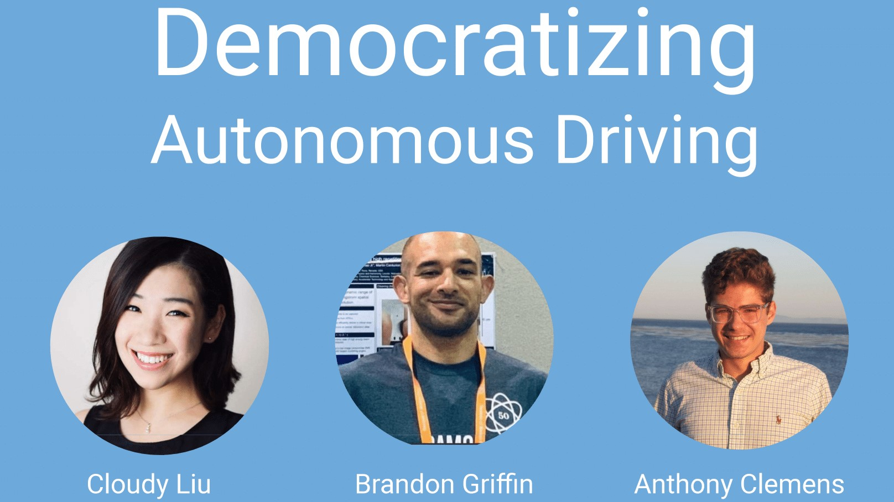

# Democratizing Autonomous Vehicle R & D
---
### Problem Statement
>The existing autonomous vehicle market is dominated by multi-billion dollar companies such as Alphabet, Tesla, Ford etc. Perceived barriers to entry include high costs, access to data, and technicality. A market with only big companies will result in monopoly/oligopoly where a few companies get to decide the price of the product, not the supply and demand relation. Consumers suffer greatly from monopoly as they don't have other options.
 
>In an effort to prevent this situation from happening, we would like to build a self-driving car model from scratch based on convolutional neural networks to showcase that self-driving is not beyond reach for smaller companies, or even startups. In fact, it is possible to build a well-performing, self-driving car model with relatively little data, basic hardware requirements, and a straightforward workflow. By doing so, we hope to incentivize additional executive leadership to join the wave of self-driving rather than sit back and be the observants.

#### **We will explore the following specific questions:**
1. Can we train a model using convolutional neural network(CNN) to keep the car in the lane and finish a track?
2. Can we optimize the model to make the car drive more like a human (more smoothly), rather than swerve in the lane?
3. Can we optimize the model to drive as fast as it could while still stay in the lane?
4. Can we use a smaller dataset to achieve similar results as big datasets?
5. Can we break through the hardware limitations of smaller companies?

---
### Table of Contents

* [Data Aquisition & Cleaning](#data_aquisition_and_cleaning)
* [Exploratory Data Analysis](#exploratory_data_analysis)
* [Image Preprocessing & Augmentation](#image_preprocessing_&_augmentation)
* [Modeling and Tuning](#modeling_and_tuning)
* [Evaluation](#evaluation)
* [Findings and Recommendations](#findings_and_recommendations)
* [Limitations and Next Steps](#limitations_and_next_steps)
* [Technical Log](#technical_log)
* [Software Requirements](#software_requirements)
* [Acknowledgements and Contact](#acknowledgements_and_contact)

---
## Data Aquisition & Cleaning

We luckily found a driving simulator open sourced by Udacity which allows us to easily collect data. Once the record button is pressed, we can control the car with WASD keyboard and the simulator will automatically generate a driving log which records images captured by three cameras placed left, center and right at the car front and the WASD inputs. In order to validate our hypothesis that even with smaller datasets, we can still build a well-performed model with CNN, we trained our model on two different datasets: Udacity-released datasets which has over 9,000 rows of data and a self-generated dataset with only 1300+ rows.

Thanks to the auto-generated driving log, there is not much data cleaning for us to do except for adding the columns to the data and fixing the file paths to cloud file paths.

### Datasets

* [Data Dictionary](#appendix)

---
## Exploratory Data Analysis
[Back to Top](#back_to_top)

The EDA is based only on the Udacity-released dataset.

The mean of steering angles is 0, with standard deviation of 0.16. We could tell that the data does not have big spread, which makes sense as too much steering should not be expected on a gentle track. The distribution of steering angles shows that 0 steering angle is the abosolute most frequent number, which confirms that the track requires mostly straight driving. A breakdown of the counts of steering angles per direction indicate that there are more left turns than right turns, which means the dataset would be baised to favorleft turns than right turns. Also, as going straight is the aboslute majority, driving straight would also be preferred. To mitigate these issues, image augmentation should be counsidered to use on our datasets, for i.e.: we should consider filp the images to create a more balanced set between turns. And limit the number of zero steerings in the sample. 

<table><tr>
<td> 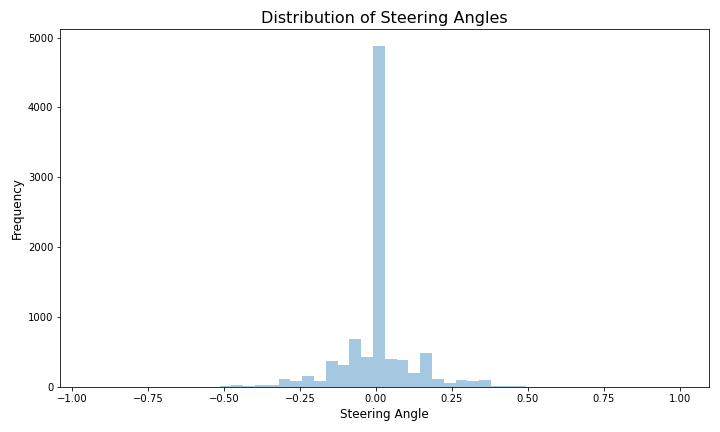 </td>
<td> 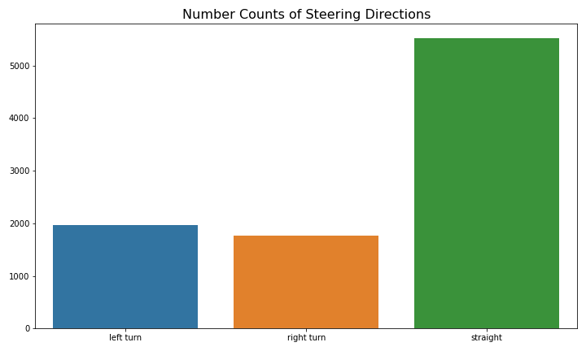 </td>
</tr></table>

By exploring the captured images from the three cameras, we found that the images from the center camera have in fact contained all the information that left and right cameras have captured. Therefore we believe the images from the center camera should be sufficient to be the only input. However, images captured from left and right could serve as our assitance in correcting the steering of the car in case it goes off center. So we would also include those images, only to adjust the steering angles accordingly with a correction angle. 

Furthermore, the original images contain irrelevant info such as sky, grass and car front which are noise rather than signal for the model. We therefore decided to crop those out of the images before feeding them into the convolutional neural networks.

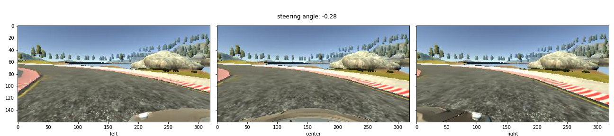
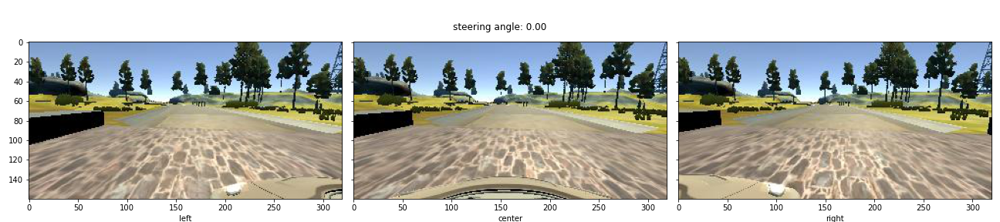
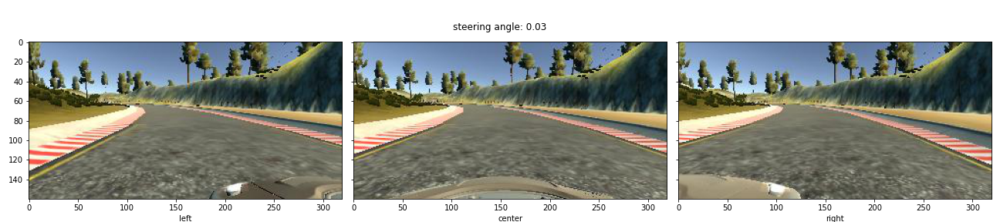

---
## Image Preprocessing & Augmentation
[Back to Top](#back_to_top)

To improve the quality of the data, image preprocessing and augmentation are applied. The preprocessing include cropping, resizing and converting the color space. Take cropping as an example, each image contains information irrelevant to the problem at hand, e.g. the sky, background, trees, hood of the car. The images are thus cropped to avoid feeding the neural network this superfluous information. Below is an example of how the images look after being cropped:

<table><tr>
<td>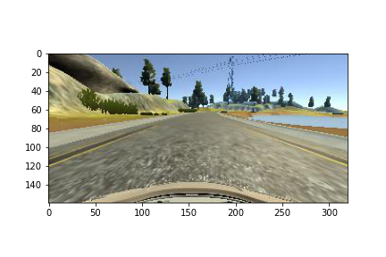</td>                   
<td>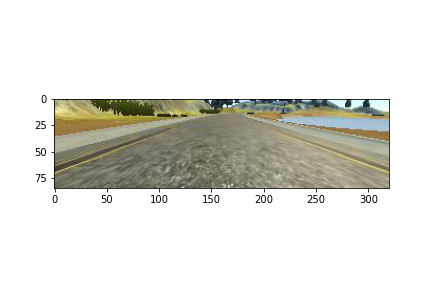</td>
</tr></table>

During model training, images are also augmented in the way of random flip, translation, shadow, or brighten transformation. Augmentation of this sort creates a more robust model that is less overfit on the training set, as we are artificially introducing variance into the training.

Below are the examples of images to which random flip was applied:

<table><tr>
<td>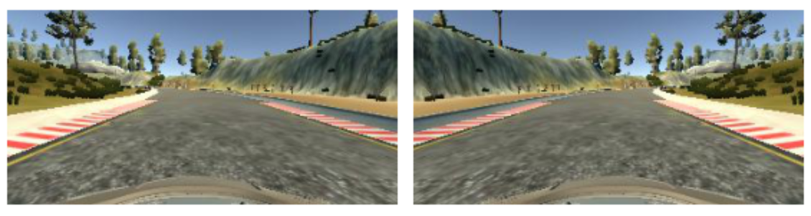</td>                   
</tr></table>

Examples of images to which random brightness was applied:

<table><tr>
<td>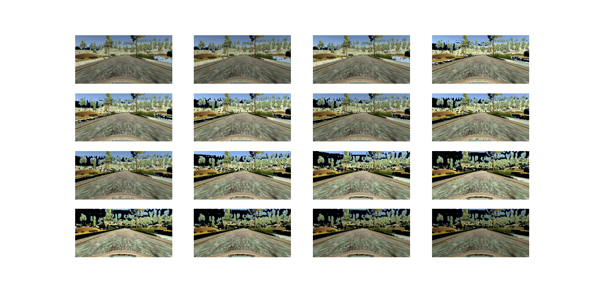</td>               
</tr></table>

Examples of images to which random shadow was applied:

<table><tr>
<td>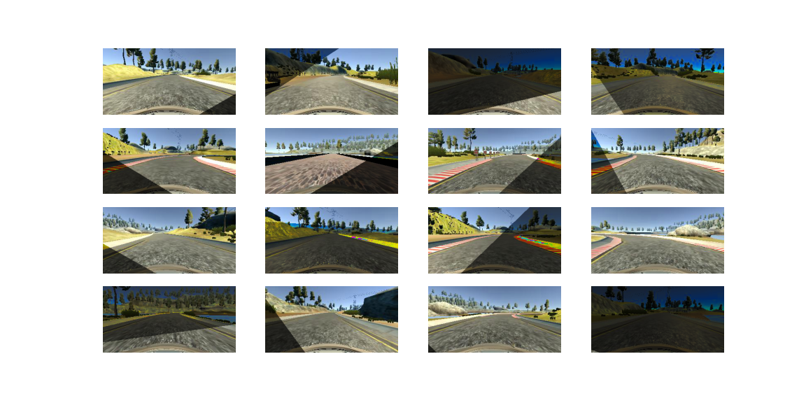</td>               
</tr></table>

---
## Modeling and Tuning
[Back to Top](#back_to_top)

Our model architecture is based on [NVIDIA](https://arxiv.org/pdf/1604.07316v1.pdf) end-to-end self-driving model which contains 1 normalized layer, 5 convolutional layers, 1 flatten layer followed by 3 fully-connected neural network layers. We used this architecture with a dropout layer and fed it with the Udacity-released datasets to establish our baseline model. The baseline model stayed on the track for 26s before crashing. Multiple tunings were applied to improve the model as well as resolving hardware limitations, including building a batch generator.

We then decided to switch to a self-generated dataset that is 1/6 the size of the Udacity datasets to see how the model will perform. We built our model upon [Naomi Shibuya](https://github.com/naokishibuya/car-behavioral-cloning)'s image preprocessing/ augmentation and batch generator with NVIDIA's model architecture with dropout layer. We also built a custom loss function to combat the swerving of the car on the track. As a result, the custom loss model did not swerve on the road as much as the Huber loss model. 

Below is the architecture of our best model: 

|**CNN Architecture**|*Kernel Size*|*Neurons*|Parameters|*Stride*|*Shape ( h x w x RGB )*|
|---|---|---|---|---|---|
|**Input Layer**|*None*|None|< sample size >|None|*( 160 x 320 x 3 )*|
|**Convolution 01**|*( 5 x 5 )*|24|1824|*( 2 x 2 )*|*(  78 x 158 x 24 )*|
|**Convolution 02**|*( 5 x 5 )*|36|21636|*( 2 x 2 )*|*(  37 x  77 x 36 )*|
|**Convolution 03**|*( 5 x 5 )*|48|43248|*( 2 x 2 )*|*(  17 x  37 x 48 )*|
|**Convolution 04**|*( 3 x 3 )*|64|27712|*None*|*(  15 x  35 x 64 )*|
|**Convolution 05**|*( 3 x 3 )*|64|36928|*None*|*(  13 x  33 x 64 )*|
|**Dropout**|*None*|None|0|*None*|*(  13 x  33 x 64 )*|
|**Flatten**|*None*|None|0|*None*|*(  27456 )*|
|**Dense 01**|*None*|100|2745700|*None*|*( 100 )*|
|**Dense 02**|*None*|50|5050|*None*|*(  50 )*|
|**Dense 03**|*None*|10|510|*None*|*(  10 )*|
|**Dense Output**|*None*|1|11|*None*|*(  1 )*|

---

## Evaluation
[Back to Top](#back_to_top)

Several cost functions, such as MSE and Huber, were utilized in evaluation of the model. Notably, a custom loss function that penalizes swerving performed best on both straightways and small turns. Of the models we built, the Huber loss model was the best in the simulator with a speed limit, but was unstable without one. On the contrary, the custom loss model could not make it around the course with a speed limit, but lasted longer on the course without one. 

<table><tr>
<td>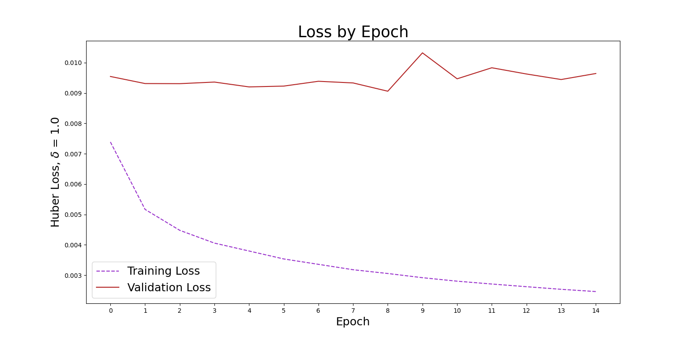</td>             
</tr></table>

Above is the loss of train and test data over epoch for our best model. Interestingly, our training didn't converge after 15 epochs, although our model was already good enough to make the car finish the lap. However, this may indicate that if we run the model with more epochs, it would perform even better. We was unable to do so within the time restraint but would love to look into that in our next step. 

We also explored in details how our data were transformed by the filter layters of the convolutional model to have a better understanding of how our model works. Below is an example of the feature maps after filter on our third convolutional layer. We can see that the model itself is able to detect the road features on its own even on roads without lane marks, which is quite impressive and shows that this model could be more efficient compared to complex ones.

<table><tr>
<td>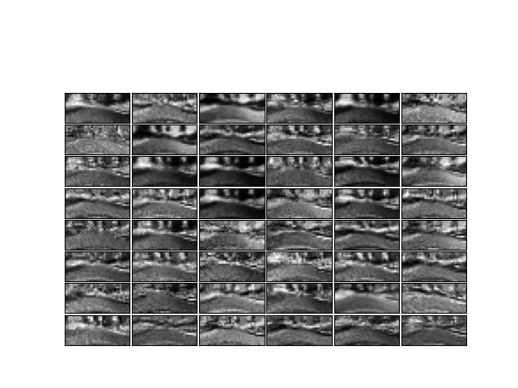</td>
</tr></table>

---
## Findings and Recommendations
[Back to Top](#back_to_top)

We found that the current architecture of the CNN is successful in keeping the car in the lane as long as a speed limit is enforced. Remarkably, without lane marks, the CNN model is able to perform well enough with a Huber Loss Function to complete an entire lap with a limited amount of training data. Less than 30 minutes of human generated data, consisting of recorded steering angles and camera images, was enough to simulate autonomous driving. Hardware limitations can be resolved by making use of a batch generator such that data is partitioned to the GPU for parallel processing with the CPU. Capital expenditure on reasearch and development is reduced by accelerating and offloading work to a GPU with a batch generator. The cost of an entry level workstation GPU to perform the job of training is less than $350, while the cost of cloud computing with a comparable GPU is less than $75 for 40 hours of training. These options are preferrable as one epoch of training without the generator took nearly four hours and would require additional training data. In contrast, an observed average of only 40 minutes per epoch was required when making use of additional GPU processing power.

In conclusion, we strongly recommend that mid-sized car companies be not intimidated to compete within the auto-tech market!

Construction of a model capable of lap completion at full speed requires additional training, however, progress was made in the limited amount of time available for this project. A custom loss function, successful in suppressing the swerving behavior of the car, may be capable of completing an entire lap when combined with the Huber loss. The current training parameters did not provide an opportunity to test the performance of the model for robustness. Our observations suggest that the performance of the model stands to improve by training the model in a variety of conditions such as, augmenting extreme weather conditions, training on multiple tracks, and taking advantage of of pre-trained models by performing transfer learning.

Companies with long-haul trip durations and wide-open travel routes are capable of taking advantage of this simple model as is. As a useful driving co-pilot, this model could be deployed as an inexpensive accident averting detection device. This would be a useful instrument in all autos, but for long roadtrips where fatigue related fatalities are a consideration it has the potential to save lives.

---
## Limitations and Next Steps
[Back to Top](#back_to_top)

Limitations:

Due to the simplistic nature of design, the application of our regression model may be limited in scope to open roadways clear of restrictions. In particular, the task of remote highway driving is much better suited for our self-driving model than is navigating through rush hour traffic in a large urban metropolis. Additionally, training times were long with the CNN and even, with a batch generator partitioning the data to the GPU, the accelerated workload ran about 40 minutes an epic. Due to the time constraints, we were not able to train enough to test whether the model could generalize to other tracks or not. This could be addressed with additional processing power.

Next Steps:

For our next steps, we would like to first increase the epochs of training. We believe this will improve our model's performance and are interested find if this could enable our model to generalize to a new track that has not been exposed to the model; We would also like to further augment the images to include different weather conditions so that the model can be generalized even more; Last but not least, to make our model more competitive, we would like to take advantage of pre-trained models and experiment with more complex road conditions such as city driving, change lanes, parking, etc to see if a CNN model could still hold. 

---
## Technical Log:
[Back to Top](#back_to_top)

### Cloning and Debugging

> * 10/27/2020 Pre-trained simulator is downloaded and run. First data collection.
> * 10/28/2020 An updated version of Keras and a dated starter code lead to a rocky start full of error messages.
> * 10/28/2020 After no success working in a virtual enviornment, Anthony brute force debugs *model.py* and *utils.py* from outdated dependencies.

### Cloud Computing with GPU

> * 10/28/2020 Anthony attempted running *model.py* on his local machine and reported 2-3 hours per epoch. The workload clearly needs to be shifted for reduced computation time as well as for practical reasons.
> * 10/28/2020 Cloudy successfully imports *utils.py* to the cloud --> from utils import INPUT_SHAPE, batch_generator, and we successfully upload *model.py* in Google Colaboratory. 
> * 10/28/2020 Anthony runs 3 epochs overnight.
> * 10/29/2020 Success! Three epochs were enough to start our self-driving car...a swerving and shifty self-driving car, but one none-the-less.

---
## Software Requirements:
[Back to Top](#back_to_top)

The simulator could be downloaded in Udacity's [repo](https://github.com/udacity/self-driving-car-sim). We used the term 3 version 1 to collect our data and test run our model. However as far as we are concerned, the version of the simulator listed in the repo doesn't affect the data collection and model performance.

A virtual environment of Python 3.7 was used to run the codes and affiliated files. The virtual environment is provided under `./assets` folder as `environment.yml` for reader's convenience. It can be installed and activated by the following commands:

`conda env create --file environments.yml`

`conda activate py37`

---
## Acknowledgements and Contact:
[Back to Top](#back_to_top)

External Resources:
* [`How to Simulate a Self-Driving Car`] (YouTube): ([*source*](https://www.youtube.com/watch?v=EaY5QiZwSP4&t=1209s))
* [`udacity/self-driving-car-sim`] (GitHub): ([*source*](https://github.com/udacity/self-driving-car-sim))
* [`naokishibuya/car-behavioral-cloning`] (GitHub): ([*source*](https://github.com/naokishibuya/car-behavioral-cloning))
* [`llSourcell/How_to_simulate_a_self_driving_car`] (GitHub): ([*source*](https://github.com/llSourcell/How_to_simulate_a_self_driving_car))

Papers:
* `End-to-End Deep Learning for Self-Driving Cars` (NVIDIA Developer Blog): ([*source*](https://developer.nvidia.com/blog/deep-learning-self-driving-cars/))
* `Explaining How End-to-End Deep Learning Steers a Self-Driving Car` (NVIDIA Developer Blog): ([*source*](https://developer.nvidia.com/blog/explaining-deep-learning-self-driving-car/))
* `End to End Learning for Self-Driving Cars` (arXiv): ([*source*](https://arxiv.org/pdf/1604.07316v1.pdf))
* `VisualBackProp: efficient visualization of CNNs` (arXiv): ([*source*](https://arxiv.org/pdf/1611.05418.pdf))

Contact:

> * Cloudy Liu      ([GitHub](https://git.generalassemb.ly/cloudmcloudyo) | [LinkedIn](https://www.linkedin.com/in/cloudyliu/))
> * Brandon Griffin ([Twitter](https://twitter.com/GriffinBran) | [LinkedIn](https://www.linkedin.com/in/griffinbran/))
> * Anthony Clemens ([GitHub](https://git.generalassemb.ly/ajclemens) | [LinkedIn](https://www.linkedin.com/in/anthony-clemens/))

---